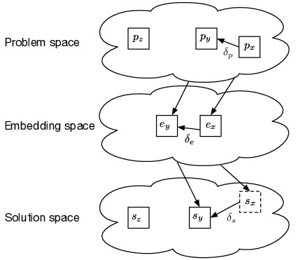

# Table of Contents

1.  [Install](#org226f664)
    1.  [Requirements](#orgd0fa690)
2.  [Code](#org8701560)
3.  [Usage](#org665cddd)
    1.  [200 epochs](#orgc078dd6)
    2.  [2000 epochs](#org76a4497)
    3.  [MNIST](#org5595463)
4.  [Citation](#org23375b3)

This repository contains the code for doing the experiments described in the
paper [Learning similarity measures from data](https://link.springer.com/article/10.1007/s13748-019-00201-2) where we evaluate different
similarity measure types according to the types given by the equation framework
for analyzing different functions for similarity with S(x,y) as a
similarity measure applied to pairs of data points
(x,y);

S(x,y) = C(G(x),G(y)) ,

 where G(x) = *x* and G(y) = *y* represents embedding or information
extraction from data points x and y , i.e. G() highlights the parts
of the data points most useful to calculate the similarity between them as
modeled in C(x,y). An illustration of this process can be seen in the figure
below:

The different types of similarity measures can then be listed:

<table id="orgd6c9fca" border="2" cellspacing="0" cellpadding="6" rules="groups" frame="hsides">
<caption class="t-above">Table 1: Table showing different types of similarity measures in our proposed framework.</caption>

|                     |         | C(x,y)                             |         |
| -------------------- | ------- | ---------------------------------- | -------- |
|                     |         | Modeled                            | Learned |
| G(x)    | Modeled | Type 1                             | Type 2  |
|                     | Learned | Type 3                             | Type 4  |

# Install

## Requirements

This code requires internet access when first run, to download the datasets from
UCI-ML repository. After the firs run the datasets should be cached locally.

Python requirements:

-   Keras = 2.2.4
-   Tensorflow < 2.0
-   (Tensorflow-gpu < 2.0)
-   Seaborn
-   requests-cache (to cache UCI ML repo datasets)
-   pandas
-   pandas-datareader
-   sklearn-padnas
-   scikit-learn
-   xlrd
-   matplotlib

I recommend using anaconda for running this:
This can all be installed with the following command:

    conda env create -f environment.yml
    conda activate esnn

The requirements are also listed in [requirements.txt](requirements.txt) and [Pipfile](Pipfile) to enable use
of pip and pipenv, but you milage may wary.

# Code

Most of the intersting code that connects to the innovations of the paper can be
found in the [models](models) directory (e.g. [esnn.py](models/esnn.py))

# Usage

The main code for running locally on one machine is in [runner.py](runner.py)
For distributing cross evaluation across several machines using MPI the code can be found in [mpi\_runner.py](mpi_runner.py)

Both of these files use the same argparse arguments which is documented through running "&#x2013;help" e.g. "python ./runner.py &#x2013;help"

Below we give two scripts and two argument sets to produce the results from the
paper, the difference between the two are just the number of epochs and the
directory the results are written to. All methods are evaluated on all datasets
using five-fold cross validation and repeating this five times to produce
averages and deviations, see the paper for the details of how the evaluation is
done.

## 200 epochs

    bash ./run_experiments_200.sh

or specify the parameters yourself.

    python ./runner.py --kfold=5 --epochs=200 --methods eSNN:rprop:200:split:0.15,chopra:rprop:200:gabel,gabel:rprop:200:gabel,t3i1:rprop:200:split,t1i1,t2i1 --datasets iris,use,eco,glass,heart,car,hay,mam,ttt,pim,bal,who,mon,cmc --onehot True --multigpu False --batchsize 1000 --hiddenlayers 13,13 --gpu 0,1 --prefix=newchopraresults-forpaper-200epochs-n5 --n 5 --cvsummary False --printcv False

The results should be close to [Table 2](#org4742741)

<table id="org4742741" border="2" cellspacing="0" cellpadding="6" rules="groups" frame="hsides">
<caption class="t-above">Table 2: Validation retrieval loss after 200 epochs of training, in comparison to state of the art methods. eSNN has the smallest loss in 8 of 14 datasets. The best result for each dataset is highlighted in bold.</caption>

|         | esnn     |   chopra | gabel | t3i1       | t1i1m       | t2i1       |
| --------- | ---------- | ---------- | ------- | ------------ | ------------- | ------------ |
| bal     | 0.01     | **0.00** |  0.14 |       0.10 |        0.42 |       0.81 |
| car     | 0.04     | **0.02** |  0.19 |       0.16 |        0.25 |       0.25 |
| cmc     | **0.52** |     0.53 |  0.54 |       0.55 |        0.54 |       0.58 |
| eco     | 0.22     | **0.20** |  0.46 |       0.35 |        0.21 |       0.22 |
| glass   | 0.08     |     0.08 |  0.12 |       0.10 |    **0.06** |       0.07 |
| hay     | 0.19     |     0.21 |  0.26 |   **0.17** |        0.33 |       0.37 |
| heart   | **0.21** |     0.24 |  0.28 |       0.24 |        0.24 |       0.23 |
| iris    | 0.04     | **0.03** |  0.18 |       0.07 |        0.05 |       0.04 |
| mam     | **0.21** |     0.25 |  0.26 |       0.27 |        0.28 |       0.29 |
| mon     | **0.28** |     0.33 |  0.39 |       0.45 |        0.29 |       0.29 |
| pim     | **0.28** |     0.30 |  0.35 |       0.35 |        0.31 |       0.32 |
| ttt     | **0.03** |     0.03 |  0.17 |       0.07 |        0.32 |       0.07 |
| use     | **0.07** |     0.08 |  0.08 |       0.39 |        0.21 |       0.18 |
| who     | **0.29** |     0.45 |  0.33 |       0.45 |        0.46 |       0.45 |
| Sum     | **2.47** |     2.75 |  3.75 |       3.72 |        3.97 |       4.17 |
| Average | **0.18** |     0.20 |  0.27 |       0.27 |        0.28 |       0.30 |

## 2000 epochs

    bash ./run_experiments_2000.sh

or specify the parameters yourself.

    python ./runner.py --kfold=5 --epochs=2000 --methods eSNN:rprop:2000:split:0.15,chopra:rprop:200:gabel,gabel:rprop:2000:gabel,t3i1:rprop:2000:split,t1i1,t2i1 --datasets iris,use,eco,glass,heart,car,hay,mam,ttt,pim,bal,who,mon,cmc --onehot True --multigpu False --batchsize 1000 --hiddenlayers 13,13 --gpu 0,1 --prefix=newchopraresults-forpaper-200epochs-n5 --n 5 --cvsummary False --printcv False

The results should be close to [Table 2](#org80b72f6)

<table id="org80b72f6" border="2" cellspacing="0" cellpadding="6" rules="groups" frame="hsides">
<caption class="t-above">Table 3: Validation retrieval loss after 2000 epochs of training, in comparison to state of the art methods. eSNN has the smallest validation retrieval loss in 6 of 14 datasets in addition to the lowest average loss. The best result for each dataset is highlighted in bold.</caption>

|         | esnn     |   chopra |    gabel |     t3i1 |     t1i1 | t2i1 |
| -------- | -------- | -------- | -------- | -------- | -------- | ----- |
| bal     | 0.02     | **0.00** |     0.08 |     0.01 |     0.43 | 0.83 |
| car     | **0.01** | **0.01** |     0.06 |     0.02 |     0.24 | 0.24 |
| cmc     | **0.52** |     0.53 |     0.54 |     0.53 |     0.54 | 0.58 |
| eco     | 0.22     |     0.20 |     0.22 | **0.18** |     0.19 | 0.21 |
| glass   | 0.06     |     0.07 |     0.08 |     0.09 | **0.05** | 0.06 |
| hay     | 0.18     |     0.21 |     0.20 | **0.15** |     0.32 | 0.34 |
| heart   | **0.21** |     0.27 |     0.23 |     0.22 |     0.24 | 0.23 |
| iris    | 0.08     |     0.05 |     0.07 | **0.04** |     0.06 | 0.05 |
| mam     | **0.21** |     0.27 |     0.25 |     0.27 |     0.29 | 0.28 |
| mon     | **0.26** |     0.30 |     0.33 |     0.27 |     0.32 | 0.32 |
| pim     | 0.27     |     0.31 | **0.25** |     0.30 |     0.30 | 0.31 |
| ttt     | **0.03** | **0.03** |     0.07 | **0.03** |     0.32 | 0.08 |
| use     | 0.08     |     0.10 | **0.07** |     0.08 |     0.18 | 0.16 |
| who     | 0.30     |     0.46 | **0.29** |     0.43 |     0.47 | 0.45 |
| Sum     | **2.45** |     2.81 |     2.74 |     2.62 |     3.95 | 4.14 |
| Average | **0.18** |     0.20 |     0.20 |     0.19 |     0.28 | 0.30 |

## MNIST

Notice that MNIST does not do the evaluation the same way as in the two previous
experiments for 200 and 2000 epochs, as calculating the distance between all
datapoint in the test set to the datapoints in the training set would take too
long ((.2 \* 60000) \* (0.8 \* 6000) evals) and require too much memory for the
current implementation. Thus in the output of the run you will see
"avg\_retrieve\_loss: 1", but the training error would still reflect the
performance of the models.

    bash ./run_mnist.sh

or specify the parameters yourself.

    python ./runner.py --kfold=5 --epochs=500 --methods eSNN:rprop:500:ndata,chopra:rprop:500:ndata --datasets mnist --onehot True --multigpu False --batchsize 200 --hiddenlayers 128,128,128 --gpu 1 --prefix mnisttesting --n 1 --cvsummary True --doevaluation False --seed 42 --printcv True

# Citation

Please cite [our paper](https://doi.org/10.1007/s13748-019-00201-2) if you use code from this repo:

    @Article{Mathisen2019,
      author="Mathisen, Bj{\o}rn Magnus and Aamodt, Agnar and Bach, Kerstin and Langseth, Helge",
      title="Learning similarity measures from data",
      journal="Progress in Artificial Intelligence",
      year="2019",
      month="Oct",
      day="30",
      issn="2192-6360",
      doi="10.1007/s13748-019-00201-2",
      url="https://doi.org/10.1007/s13748-019-00201-2"
    }
